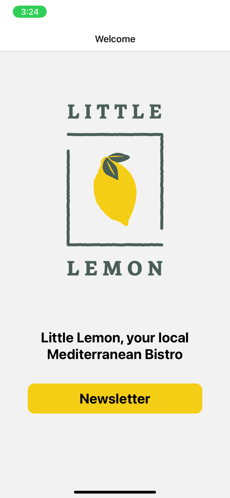
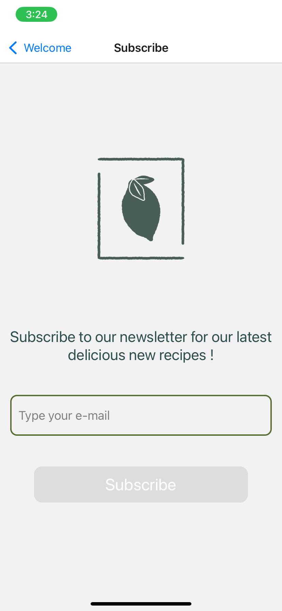
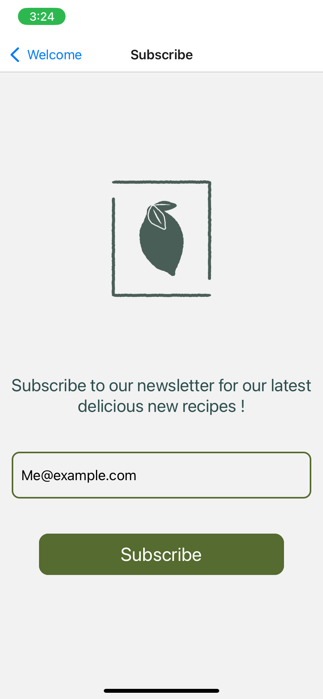
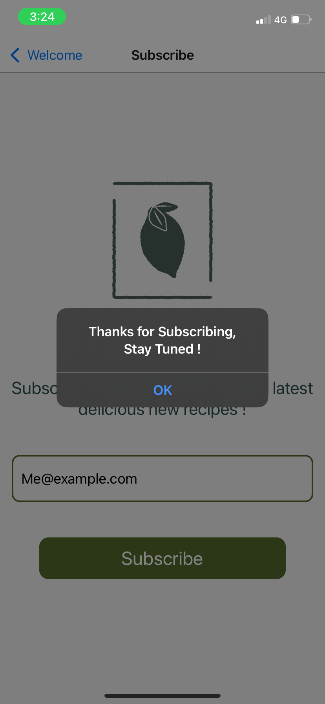

# Little Lemon App

Little Lemon is a simple React Native application designed to showcase a local Mediterranean Bistro. The app includes a welcome screen and a subscription screen for a newsletter.

## Features

- **Welcome Screen**: Introduces the user to Little Lemon Bistro with a logo and a brief description.
- **Subscription Screen**: Allows users to enter their email to subscribe to the Little Lemon newsletter.

## Screens

### Welcome Screen

The Welcome Screen features the Little Lemon logo and a brief introduction to the bistro. It also provides a button to navigate to the subscription screen.

### Subscription Screen

The Subscription Screen allows users to subscribe to the Little Lemon newsletter by entering their email address. The email is validated before the subscription is accepted.

## Navigation

The app uses React Navigation to navigate between the Welcome and Subscribe screens. The `RootNavigator` component sets up the navigation stack.

## Email Validation

The app includes a utility function to validate email addresses, ensuring that users enter a properly formatted email address before subscribing to the newsletter.

## How to Run

To run this project, make sure you have the required dependencies and React Native environment set up. Then, run the app using the following commands:

```bash
npx react-native start
npx react-native run-android # For Android
npx react-native run-ios # For iOS
```

## Screenshots

- Welcome Page



- Subscribe page






